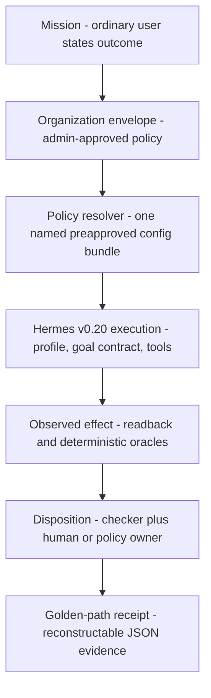

# Enterprise Agent Deployment Field Kit for Hermes

A field kit for deploying [NousResearch/hermes-agent](https://github.com/NousResearch/hermes-agent) inside an organization with bounded authority, policy-resolved configuration, typed verification, and reconstructable evidence — validated against the exact release **v0.20.0 / tag `v2026.8.3`**.

```text
$ bash scripts/demo_mission_s1.sh
=== Enterprise Agent Deployment Field Kit — S1 vendor exception ===
Org pack: packs/organizations/nimbus-synthetic

MISSION_DEMO_PASS run_id=s1-decide-... terminal=accepted recommendation=defer-pending-legal oracle_passed=True
```

## Why this exists

Agent runtimes ship capable primitives; organizations still fail at the layer above them — deciding which work an agent should do at all, resolving a safe configuration without making every user a runtime expert, proving results with evidence stronger than the agent's self-report, and owning the agent after handoff. This kit is that layer, built Hermes-first from real regulated-reporting deployment experience, with every capability claim pinned to a preflighted release instead of vendor marketing.

## Architecture



A vendor-neutral control kernel (lifecycle, authority, proportionality, waivers, assurance) sits under a version-pinned Hermes mapping: every one of 318 requirement rows is classified `native` / `configuration` / `extension` / `surrounding-platform` / `unsupported-gap` against the exact tag. The doctrine — **Reconciled Autonomy** — is that an agent earns bounded authority only when authorized intent, observed effect, and an independently classified disposition reconcile.

## Quickstart

Python 3.10+ and bash; no Hermes install, API keys, or network access required for the demo path.

```bash
git clone <this-repo>
cd hermes-enterprise-field-kit
pip install -r requirements.txt   # jsonschema, used by the negative-test oracle

# Mission demo: org-pack resolution -> producer -> oracle -> receipt
bash scripts/demo_mission_s1.sh

# Negative tests: 8 fail-closed cases through the real pipeline
python3 scripts/run_negative_tests.py

# Kernel guard: proves the core stays vendor-neutral
python3 scripts/check_neutral_core.py
```

The `--live` path runs the same mission through a real Hermes daemon behind a two-factor spend gate (authorization file on disk + Portal spend cap — see [spend-authorization/](spend-authorization/README.md)). One live S1 receipt is committed at [`reference-suite/runs/s1-decide-20260811-025135/`](reference-suite/runs/s1-decide-20260811-025135/).

## What is in the box

| Area | Contents |
|---|---|
| [`kit/DOCTRINE.md`](kit/DOCTRINE.md) | Product doctrine: progressive disclosure, policy resolution, Reconciled Autonomy |
| [`kit/core/`](kit/core/) · [`kit/lifecycle/`](kit/lifecycle/) · [`kit/assurance/`](kit/assurance/) | Frozen vendor-neutral kernel: six-stage lifecycle, eight assurance modules, proportionality, waivers |
| [`kit/instrument/`](kit/instrument/) | Deterministic scoping/decision intake with schemas, fixtures, and oracles — including the honest outcomes `defer` and `do_not_agentize` |
| [`kit/mapping/`](kit/mapping/) | The 318-row Hermes v0.20 deployment map, capability-gap ledger, and generation lock |
| [`kit/preflight/`](kit/preflight/) | Exact-release preflight report (214 tests, verdict `PASS_WITH_LIMITS`) |
| [`packs/`](packs/README.md) | Synthetic organization pack (Nimbus Widgets), execution profile, optional workflow packs |
| [`reference-suite/`](reference-suite/README.md) | Decide/coordinate/act archetypes, config bundles, oracles, negative tests, evidence packets, committed run receipts |
| [`scripts/`](scripts/) | Mission runner, resolver, staging service, evidence-packet assembly and reconstruction, guards |

## Honest status

- **Field Kit preview.** Extracted from a private build surface; the desk test and full validation set have not yet passed, so no v0.1 claim is made.
- Three reference receipts are **dry runs, labeled as such**; one S1 run is **live** through canonical Hermes. Cost fields are honestly `NOT_RUN` (no Portal readback yet).
- Receipts are mutable kit artifacts, not immutable audit; the preflight report states exactly what v0.20 supplies, supplies with limits, or does not supply.
- `kit/mapping/b05-generation.lock.json` pins the digests of a few generator inputs (build tickets and a research draft) that remain private; the lock and `scripts/generate_b05_mapping.py` are shipped for transparency but cannot be fully re-run from this tree alone.
- **Hermes Assembly** appears in these documents only as a *proposed, uncleared* product concept — it is not an official Nous product name and no partnership is claimed.

- The live S1 receipt reports `anthropic/claude-fable-5` via the operator's configured Nous inference route — the kit is model-agnostic and records whatever the resolved profile selects; the receipt's `runtime_reported` field is the authority.
- Demo runs write new receipt directories under `reference-suite/runs/` (gitignored); the committed exemplar receipts are the reviewed ones.

## Testing

`run_negative_tests.py` (8/8 fail-closed cases through the real pipeline), `check_neutral_core.py` (kernel neutrality guard), deterministic workflow oracles per archetype, and non-producer packet reconstruction via `scripts/reconstruct_from_packet.py`.

## License and author

MIT. Built by [Dave Bettner](https://davebettner.com) — agent systems engineering for regulated enterprise platforms.
