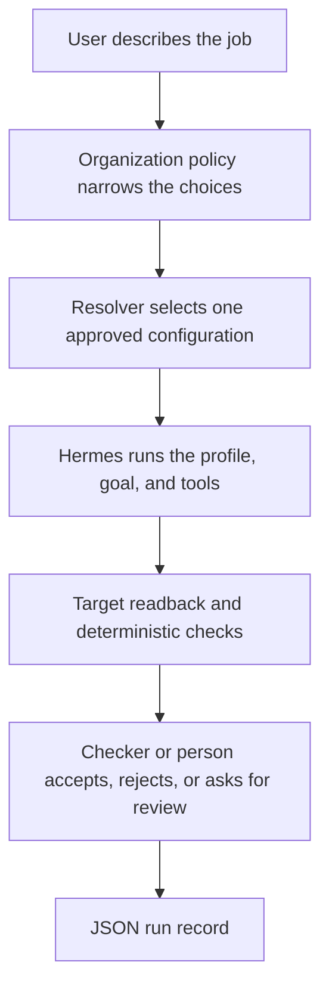

# Hermes Enterprise Field Kit

> **Provenance:** This repository is a sanitized public extract published in August 2026.
> Its Git history is publication history, not a full private development archive. It
> contains no client data, credentials, or spend authorization files, and it does not
> offer the complete private build history.

I built this repository to answer a practical question: what would it take to run
[Hermes Agent](https://github.com/NousResearch/hermes-agent) inside a real organization
without asking every user to become an agent-platform expert?

The result is a working prototype around the exact Hermes release **v0.20.0 / tag
`v2026.8.3`**. It takes a plain-language mission, applies an organization's rules,
selects an approved configuration, runs a set of independent checks, and records what
happened. It is my project, not an official Nous product or partnership.

```text
$ bash scripts/demo_mission_s1.sh
=== Enterprise Agent Deployment Field Kit — S1 vendor exception ===
Org pack: packs/organizations/nimbus-synthetic

MISSION_DEMO_PASS run_id=s1-decide-... terminal=needs_review recommendation=defer-pending-legal oracle_passed=True
```

The important part of that output is `needs_review`. The local checker passed, but the
case still needs a person to make the decision. A green script does not get to invent
human approval.

## Verify in 5 minutes

```bash
git clone https://github.com/dbett4/hermes-enterprise-field-kit.git
cd hermes-enterprise-field-kit
pip install -r requirements.txt
./scripts/proof.sh
```

That offline path validates the public 318-row map, eight negative-test fixtures, the
neutral core, runtime attestation guards, the committed operator-recorded receipt, and
the deterministic S1 demo. It uses no API keys, no network, and no live Hermes call.

To prove only the published map snapshot:

```bash
python3 scripts/verify_public_mapping.py
```

The preflight for the pinned release ran **214 focused tests** against the exact peeled
commit `3c27eb6234bf91b8ceee9e9071591b31e9b148cb` (tag `v2026.8.3`). That number is
pinned to that commit's test list in `kit/preflight/v0.20-preflight-report.md`; it is not
a claim about every Hermes feature.

**Live attestation gap:** there is still no committed live receipt that cryptographically
ties a model response to the pinned Hermes executable. The older S1 record remains
`operator-recorded-unattested`. Use `scripts/live_proof.sh` only with explicit owner
authorization and a spend cap when you intend to spend money on a real run.

## Start here

The demo requires Python 3.10+ and bash. It does not install Hermes, call a model, use an
API key, or need network access.

```bash
git clone https://github.com/dbett4/hermes-enterprise-field-kit.git
cd hermes-enterprise-field-kit
pip install -r requirements.txt

# Run one synthetic mission end to end
bash scripts/demo_mission_s1.sh

# Exercise eight failure cases
python3 scripts/run_negative_tests.py

# Check that the reusable core contains no Hermes-specific terms
python3 scripts/check_neutral_core.py

# Run every credential-free check used by this repository
./scripts/proof.sh
```

`proof.sh` performs no dependency installation or network access. It stops at the first
failure and prints `FIELD_KIT_PROOF_PASS` only when the whole set passes. Install the
pinned requirements first as shown above. [PROOF.md](PROOF.md) lists the command behind
each result.

## How it works



I split the design into two parts:

- A small vendor-neutral core covers qualification, authority, testing, operation, and
  retirement. This keeps the operating rules from depending on undocumented Hermes
  behavior.
- A version-pinned Hermes adapter says where each requirement is handled: by Hermes
  itself, by configuration, by this kit, by surrounding infrastructure, or not at all.

The generated map contains **318 schema-valid rows** and a **seven-item gap list**. The
preflight for the pinned release ran **214 focused tests** and ended
`PASS_WITH_LIMITS`. Those limits matter: managed scope is not an OS sandbox, Kanban is
not an immutable audit log, and provider fallback is not intelligent model selection.

## What is worth reviewing

- [`reference-suite/`](reference-suite/README.md) contains three synthetic jobs:
  recommend on a vendor exception, coordinate an employee offboarding packet, and make
  a reversible change to a local staging service.
- [`packs/`](packs/README.md) shows how organization policy and workflow-specific rules
  combine without silently widening permissions.
- [`kit/mapping/`](kit/mapping/README.md) is the 318-row release map and gap list.
- [`kit/preflight/`](kit/preflight/v0.20-preflight-report.md) records what I actually
  tested against Hermes v0.20.
- [`kit/`](kit/README.md) contains the longer deployment method.
- [`scripts/`](scripts/) contains the resolver, runner, checkers, reconstruction tools,
  and repository guards.

## Live-run path

The non-demo runner calls the Hermes CLI only after two spend controls are present: an
owner-created authorization file and a matching Nous Portal per-member cap. It rejects
a mismatched CLI version and saves the native version output, executable SHA-256, and
input/output digests. See [`spend-authorization/`](spend-authorization/README.md).

One older S1 record is committed under
[`reference-suite/runs/s1-decide-20260811-025135/`](reference-suite/runs/s1-decide-20260811-025135/).
Its output is internally consistent and the deterministic checker passes, but the run
predates the CLI identity guard. The provider and model fields were recorded by the
operator. There is no native session or version artifact tying that output to the
declared Hermes release, provider, or model, so I do **not** treat it as proof of a live
Hermes run.

## Current limits

- This is a preview built from synthetic cases, not a customer deployment.
- Three committed reference records are labeled dry runs. The older S1 record is
  labeled `operator-recorded-unattested` and remains `needs_review`.
- Provider cost is `NOT_RUN`; I have not published a cost or ROI result.
- Run records are ordinary mutable files in this repository, not an immutable audit
  system.
- A few private build inputs are represented only by their digests in
  `kit/mapping/b05-generation.lock.json`. You can validate the shipped map and generator,
  but cannot reproduce those private inputs from this public tree.
- The older record names `anthropic/claude-fable-5`, but that is operator-entered
  metadata. Future non-demo runs collect stronger CLI identity data; even then, a
  version probe alone does not tie executable bytes to a source commit.
- Demo runs create new ignored directories under `reference-suite/runs/`; the committed
  examples are the reviewed copies.

## Author

MIT licensed. Built by [Dave Bettner](https://davebettner.com).
